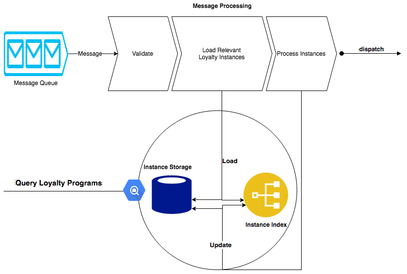

<!-- .slide: data-background-image="assets/gitpitch-audience.jpg" data-background-size="100% 100%" data-background-color=" " data-state="bg-img-opacity-15" -->
# Business Bookers Backenders

### Loyalty Engine

---

<!-- .slide: data-background-image="assets/gitpitch-audience.jpg" data-background-size="100% 100%" data-background-color=" " data-state="bg-img-opacity-15" -->

## Motivation

- Current solution does not allow easy scaling of loyalty programs  <!-- .element: class="fragment" -->
- Requires a lot of duplicating code and date  <!-- .element: class="fragment" -->
- No easy way of monitoring, debugging or querying loyalty programs state <!-- .element: class="fragment" -->

---

<!-- .slide: data-background-image="assets/gitpitch-audience.jpg" data-background-size="100% 100%" data-background-color=" " data-state="bg-img-opacity-15" -->

## Proposed Solution

- Build a new generic LoyaltyEngine™ that will:
 - alow multiple loyalty programs in parallel
 - be scalable to allow increse in traffic and load, as well as experimentation
 - allow monitoring (logs/metrics) for all actions regarding loyalty programs
 - Provide an API for querying state of loyalty programs and owners

---
<!-- .slide: data-background-image="assets/gitpitch-audience.jpg" data-background-size="100% 100%" data-background-color=" " data-state="bg-img-opacity-15" -->

High Level Design

